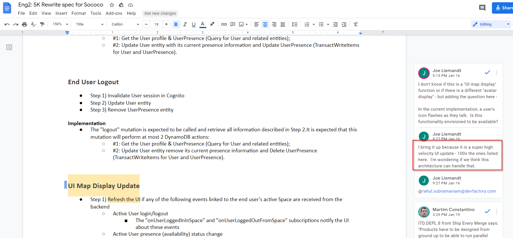
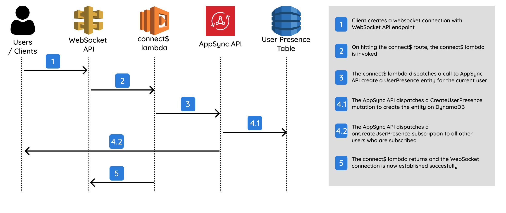
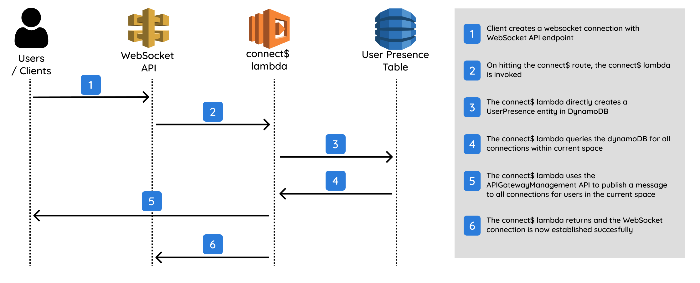

# Cross-region architecture for realtime user presence

## Author

Ashwanth A R

## Demo

Link to DEMO

## Problem Statement

Choosing a topic for open hackathons can be really hard. You can literally start anywhere.
While I was looking for a problem statement, and going through the Rewrite spec for Sococo, I came across this comment:



This looked like a good problem to try, and solve. My initial idea was to create a scalable solution for user presence, and user typing (both being high-velocity updates).

As I started discussing various possible architectures with my SEM, I realized that I had to narrow the scope to something that could be achieved in one week. This is a hard problem to solve, and the idea was not to reach the final solution, but to develop a POC that moves in the direction of enabling us to achieve high-velocity UI updates in realtime.

So, we narrowed down the problem to, "Provide an architecture for serverless realtime 'user presence' that works across 2 regions". The key goals was to keep the solution "serverless", has to be "realtime or near realtime" and has to have the ability to add nodes/endpoints to different regions ("cross-region").

The idea was that this solution could serve as a starting point to provide a solution that could support horizontal scaling, that is we could add more nodes as our load increases and balance the load across these nodes. By having your Route53 route one domain to different services based on geolocation rules and service health checks, this architecture should in theory also enable us to also build highly available applications.

## Important Technical Decisions:

As I experimented with various architectures, I had to compare and make several decisions all across the stack. So, in this section I will break these down into sections/layers in the stack and explain my reasoning behind why I felt an option was more suitable than the others considered.

### 1. Database storage (for keeping track of user presence information persistently)

- **DynamoDB**
- RDS

Our use-case is a pure OLTP requirement, and we have a perfect understanding of our access pattern:
Query -> ListUsersInSpace, Mutations -> CreateUserPresence, DeleteUserPresence, UpdateUserPresence (update for heartbeat). There is no need for any ad-hoc queries, and we want the ability to scale horizontally.

For these reasons, DynamoDB seems like the correct choice.

Reference: [Check out Rick Houlihan's talk at 6:16 for when to use NoSQL](https://youtu.be/6yqfmXiZTlM?t=376)

### 2. Cross-region replication

- **DynamoDB global tables**
- Custom solution with logic that replicates data between tables

DynamoDB gives you a fully managed, multi-region database for massively scaled global applications. They automatically replicated data across regions, resolves update conflicts. Building all of this capability ourself is error-prone, time-consuming, labor-intensive, and adds a lot of maintenance complexity to our services.

They enable you to deliver low-latency data access to your users no matter where they are located, and replication is propagated to all replica tables within seconds.

We use global tables `Version 2019.11.21` over `Version 2017.11.29` because this is AWS recommended, enables you to dynamically add new replica tables from a table that is already populated with data, is more efficient, consumes less write capacity, and has more regions support.

The concern/question I have here at this point, is that the replication is specified as eventually-consistent. During my experiments, the replication was almost immediate and reliably consistent, however it is important to note that my experiments were small scale, and I haven't had the opportunity to set up some form of stress testing.

```ts
// CDK code for:
// Cross-region replication of dynamodb tables with stream
const tableName = withEnv("user-presence");
const table = new Table(this, tableName, {
  tableName,
  billingMode: BillingMode.PAY_PER_REQUEST,
  partitionKey: {
    name: "connectionId",
    type: AttributeType.STRING,
  },
  stream: StreamViewType.NEW_AND_OLD_IMAGES,
  replicationRegions: ["ap-south-1"],
});
```

### 3. WebSockets

We need a websocket two-way connection to track users who are online. When users drop off (and the connection drops), we delete their user presence in database.

- **Use AWS managed WebSockets API Gateway**
- Use third-party libraries to write our own websocket server

Going along our preferred approach of stay serverless, stay managed, it makes sense to use the AWS managed WebSockets API gateway. The only issue at this point is that the AWS CDK still does not have a high-level API to enable the creation of this resource, but it does expose all the individual low-level constructs of the API, so its not that much of a problem, and we can just use these instead.

It's a lot easier and much faster to start off with this managed API gateway for websockets. You need to define any routes such as connect$, disconnect$, heartbeat etc., and you need to provide an integration point where hitting these routes will invoke a specific lambda.

```ts
// CDK Code for:
// WebSockets API Gateway setup

// Websocket API
const wssApi = new CfnApi(this, wssApiName, {
  name: wssApiName,
  protocolType: "WEBSOCKET",
  routeSelectionExpression: "$request.body.action",
});

// Integration is the interface between WS API route and a lambda
const integration = new CfnIntegration(this, integName, {
  apiId: wssApi.ref,
  // Proxy to an AWS service - LAMBDA_PROXY in this case
  integrationType: "AWS_PROXY",
  // Example URI: arn:aws:apigateway:${region}:lambda:path/2015-03-31/functions/${fnArn}/invocations
  // fnArn -> comes from a lambda that is already defined in the CDK code
  integrationUri: integUri,
  credentialsArn: role.roleArn,
});

// WS API route
const route = new CfnRoute(this, routeName, {
  apiId: wssApi.ref,
  // eg: $connect - route invoked when websocket connection is established
  routeKey: route.key,
  // can be NONE, AWS_IAM, JWT or CUSTOM
  authorizationType: "NONE",
  // target integration
  target: `integrations/${integration.ref}`,
});

// Make sure that you add a ConcreteDependable so that CfnDeployment is run after the routes are deployed by CDK
const wssDeployment = new CfnDeployment(this, withEnv("wss-deployment"), {
  apiId: wssApi.ref,
});

new CfnStage(this, withEnv("wss-stage"), {
  stageName,
  apiId: wssApi.ref,
  deploymentId: wssDeployment.ref,
});
```

### 4. Publish-Subscribe service

User presence requires some sort of publish and subscribe system to announce users coming online or going offline. The same channel could be used for high-velocity UI updates like "user is typing" etc.

- **Publish events directly into the websocket connection via Websockets API Gateway**
- Publish events into ElastiCache which is interfaced with the websocket connection
- Use AppSync subscriptions to keep track of 'UserPresence' entities created or destroyed

AppSync is eliminated as an option. I had actually setup a complete implementation at some point that was working for one region. But when you create a second AppSync endpoint in a different region, there are some issues with being able to get subscriptions to fire for the second region (when you have a mutation in region 1).

AppSync is not built to handle multi-region application design, and is currently a feature request with the AWS team. You can see more information about this in the support case [here](https://console.aws.amazon.com/support/home#/case/?displayId=7912149581&language=en). As of now, if we are using AppSync, then our implementation would be limited to one endpoint in one region (which therefore is a restriction for horizontal scaling) if we want to use the subscriptions feature in AppSync. We still have the flexibility to build multi-region AppSync APIs should we have only a use case for queries and mutations. See example architecture [here](https://iamondemand.com/blog/building-a-multi-region-serverless-app-with-aws-appsync/#:~:text=Building%20a%20Multi%2DRegion%20AppSync%20App&text=Location%2Dbased%20routing%20allows%20me,same%20name%20in%20other%20regions.)

ElastiCache is still very much a viable solution and would need to be explored to see if we get better latencies should the current solution not suffice. I skipped on this option because one of the goals was to keep the solution serverless, and with my lack of experience working with ElastiCache, I was not sure if I could have a complete working implementation in the time given.
ElastiCache references to explore real-time application architectures:

- [Massive Scale Real-Time Messaging for Multiplayer Games](https://d1.awsstatic.com/architecture-diagrams/ArchitectureDiagrams/large-scale-messaging-for-multiplayer-games-ra.pdf?did=wp_card&trk=wp_card)
- [Building real-time applications with Amazon ElastiCache - ADB204 - Anaheim AWS Summit](https://www.slideshare.net/AmazonWebServices/building-realtime-applications-with-amazon-elasticache-adb204-anaheim-aws-summit)

Publishing events into the websocket connection directly was the approach chosen here.

The initial pubsub implementation I had with AppSync looked like this:


Because AppSync multi-region is not supported, I switched to the following pubsub implementation:


### 5. Sync realtime user presence notifications in region 1 to PubSub service in region 2

There are a couple of options for real-time notifications to be streamed to the node in the second region:

- **DynamoDB Streams and AWS Lambda Triggers**
- Connect$ lambda directly publishes notifications to websocket in region 2

We need one point of communication between multiple regions and ensuring only one connection point is vital to having a reliable architecture with a single source of truth. This makes sure that there is no race condition between the pubsub notification reaching region 2 before the database in region 2 has the same data thereby resulting in consistency issues.

DynamoDB stream which replicates data from ddb in one region to another can be used as a trigger to invoke a lambda. In this lambda we publish the notifications (that user has come online or gone offline) to clients that are connected on websocket API in region 2.

### 6. Expiry of user-presence records

- **Heartbeat service with expiry mechanism**
- TTL in DynamoDB

On disconnecting the websocket connection, the disconnect$ lambda removes the UserPresence entry from our DynamoDB table. However, the disconnect$ lambda is invoked on a best effort basis, and there are situations where it does not fire. So, we need some way to expire our UserPresence records from the DynamoDB table. The first option I considered was setting a TTL value on my item.

But DynamoDB specifies that items are typically deleted within 48 hours of expiration on a best-effort basis to ensure availability of throughput for other data operations. This makes it unsuitable for realtime requirements like UserPresence.

Reference to AWS Support case [here](https://console.aws.amazon.com/support/home#/case/?displayId=7907906101&language=en).

The option that should be considered here (I did not find the time to actually implement this in my POC), is to have a heartbeat service which creates a delayed trigger lambda (using AWS Step Functions) which gets cancelled at the next heartbeat. If 2 consecutive heartbeat lambdas are not invoked, then the delayed trigger lambda will run and delete the UserPresence notification.

## References

- [Building a Multi-Region Serverless App with AWS AppSync](https://iamondemand.com/blog/building-a-multi-region-serverless-app-with-aws-appsync/#:~:text=Building%20a%20Multi%2DRegion%20AppSync%20App&text=Location%2Dbased%20routing%20allows%20me,same%20name%20in%20other%20regions.)
